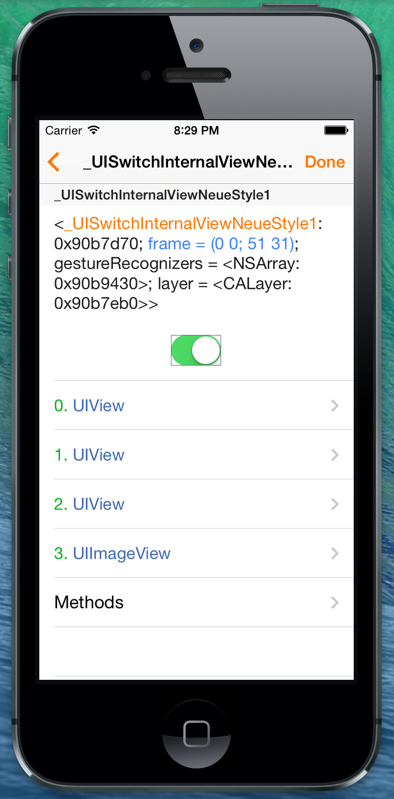

Curious
==========
The idea behind this tool is to provide a simple way to inspect your iOS Apps hierarchy directly inside your App. 
You are able to navigate from your main UIWindow inside your UINavigationController or UITabbarController or UIVIewController to discover all your UIViews and their subviews hierarchy.

Something similar to what  [Reveal](http://revealapp.com "Reveal") do from your Mac or [Cycript](http://www.cycript.org "Cycript") at command line, but directly in your app.



Usage
-------------
Import the folder CuriousInspector in your Xcode's project
You can show the built in Inspector ViewController manually using 

 ```objective-c
[MPInspectorManager present]
```

or the others convenience methods or changing the system volume (pressing volume buttons). 

(Disable that changing
 
` #define USE_VOLUME_CONTROL_TO_SHOW 1 `

 to 0 in MPInspectorManager.h)


What Inspired me?
--------------
 [Facebook's Tweaks Project](https://github.com/facebook/Tweaks "Facebook's Tweaks Project") inspired me. It's a cool idea but require some works to integrate it, I wanted something that works out of the box and more generic.


What's the progress ?
-------------
Actually it is a WIP project, I worked on it some minutes/hours and I hope to find time for it, contributors are well accepted! It actually show you a section in a UITableView for every object passed and show the object description in the first row and the related objects' descriptions in the other rows (viewController's of a UINavigation/TabbarController , subviews of a UIView....) just to navigate.
Obviosly that is just the basic, see the next paragraph for the planned features.

Planned Features
-----------------
1. ~ Cells Design based on the cell type (object description, related objects,....)
2. Every section will have that structure: First Cell : Object Description, n cells for related objects (tappable to navigate in the hierarchy )  , List of properties/methods of the object and some kind of features to play with these methods with the Objective C runtime (For example change the textColor of a UILabel)
3. ✔ ~~Get a snapshot of the selected object (to not be lost inside the hierarchy)~~
4. A mobile substrate tweak to use this everywhere on iOS
5. ... lot of other ideas.

Why I would need that?
--------------
That tool would be useful for newbie to understand how an App/iOs works but even for more experienced developer to change quickly some behaviors or DEBUG some stuff (Who knows ?), or designers to visualize changes quickly.

When ?
---------------
I don't have much time for that project but I hope to find some to work on it.

LICENSE
---------------
[GPL v2](http://www.gnu.org/licenses/gpl-2.0.html "GPL v2")
